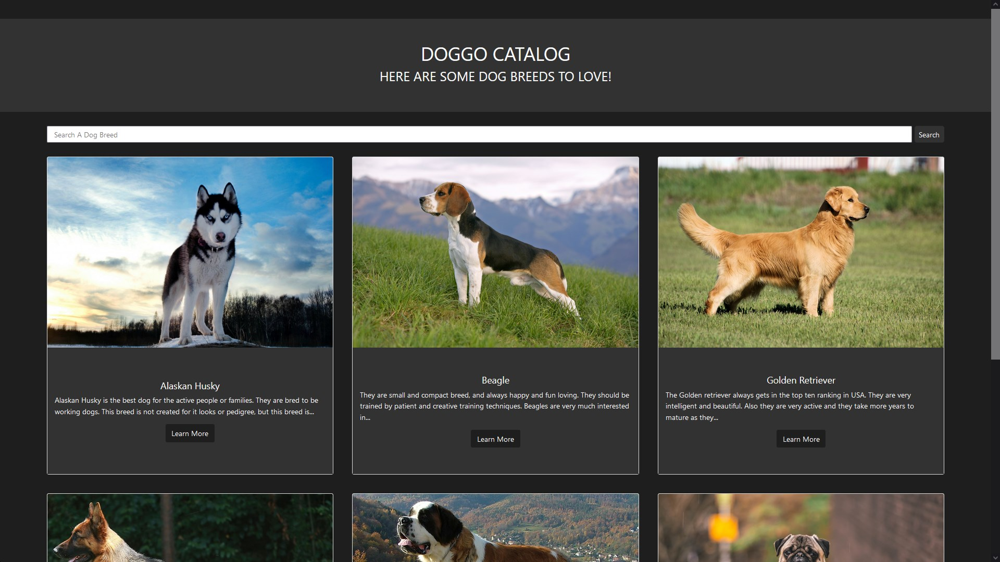

# [Doggo Catalog](https://ozgurata.github.io/Doggo-Catalog/)

---

### Doggo Catalog is a site to help users search different dog breeds and obtain more information about them

Features are:
* Look up different dog breeds with **easy to read** cards with **distinctive images** of each spesific breed
* Search breeds using **interactive search bar** that **filters results** as user types
* Obtain **detailed** information such as:
    * History
    * Description
    * and Characteristics

This site is made using:
* HTML
* CSS
* Bootstrap (Requirement for CS50)
* JavaScript

All the information about the breeds are obtained from [mydogbreeds.com](https://www.mydogbreeds.com)

##### (This site is a submission to CS50 Homepage problem)
